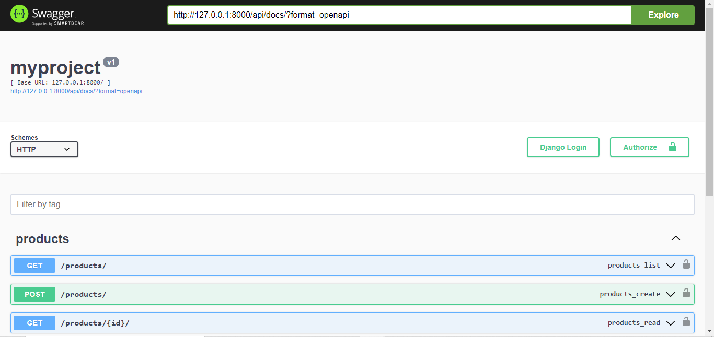

# HOW TO IMPLEMENT SWAGGER IN DJANGO REST FRAMEWORK (DRF)

### INTRODUCTION
### PREREQUISITE
### BODY
### CONCLUSION

## INTRODUCTION:
Swagger is an open-source framework that helps developers design, build,  document, and consume RESTFUL web services.It is used to document APIs, which helps the developers to understand the basic behavior of every endpoint created. It also outlines all available models in a particular project. This is very helpful to developers as it saves long hours of meetings.

__Swagger uses JavaScript Object Notation (JSON) and YAML Ain't Markup Language (YAML) called openAPI specification__ (OAS) to define APIs. This specification includes details such as endpoints, methods, requests, and responses.Some of the importance of integrating swagger docs in the backend of your code includes:
- Automated documentation of API 
- Testing and debugging

This article  will focus on swagger documenting UI and integrating swagger in your Django REST framework project.


## PREREQUISITE
- Python

## SET UP A VIRTUAL ENVIRONMENT
To continue, you will need to install the necessary dependencies needed for the swagger implementation.

Next, you need to create a virtual environment. It can be created with the code below. Depending on the version of Python you downloaded. For python 3.12. 1. Use this command below.
```bash
python -m venv {venv name}
```
Where the ‘{venv name}’ refers to any desired name you give to your virtual environment(venv). The convention is using Venv but whatever name you choose to use is totally up to you.
It should look like this
```bash
python -m venv venv
```
Then run this command on Windows to activate your virtual environment 
```bash 
Venv/Scripts/activate
```
On Linux, run this command to activate your Venv 
```bash
venv/bin/activate
```

Now, you need to install Django and Django REST framework (drf) within your virtual environment. To install Django, use this command 
```bash
pip install django
```
Then this is to install Django REST framework(DRF)
```bash
pip install djangorestframework
```
These are the necessary packages you need to start up a simple django Restframework (DRF) application 

## CREATE A SAMPLE APPLICATION
After setting up your virtual environment (Venv), installing Django and Django rest framework within your virtual environment, you will need to start a new project.
Run the command below to set up a new project.
```bash
django-admin startproject myproject
```
This will create a new directory called __myproject__ with the basic structure of Django in it. You can run your server to make sure everything is working fine.
You should create a simple model for products.
There are several ways to do this but I prefer creating a new app for each functionality in the project. 
Run this command on your terminal to do so.
```bash
python manage.py startapp products
```

This will create a new directory with the basic structure of an app in it. 
Navigate to your __“settings.py”__ file and include the __‘products’__ to your installed app. 
** Pictures **
Navigate to your app directory, in this case, it is products and create a simple model for it in your app's models.py file
```bash
class Product(models.Model):
    id = models.UUIDField(primary_key=True)
    name = models.CharField(max_length=300)
    description = models.CharField(max_length=500)
    quantity = models.BigIntegerField()
    createdat = models.DateTimeField(auto_now=True)
    updatedat = models.DateTimeField(auto_now_add=True)
  ```

Then run migrations with the code below
```bash
python manage.py makemigrations
```
After that, apply those changes by running:
```bash
python manage.py migrate
```
Create a serializer class to serialize your data. You need to create a serializer.py file in your app directory(products directory). In your serializer file, create a serializer class


```bash
from rest_framework import serializers
from .models import Product


class ProductSerializer(serializers.Serializer):
      class Meta:
        model = Product
        fields = '__all__'


```

In your product views.py, create a simple crud. 
```bash
from django.shortcuts import get_object_or_404
from django.shortcuts import render
from rest_framework.views import APIView
from rest_framework.response import Response
from rest_framework import status
from accounts.models import Product
from .serializers import ProductSerializer

class ProductListCreateAPIView(APIView):
    """
    API endpoint for listing and creating products.

    GET:
    Returns a list of all products.

    POST:
    Creates a new product.

    Raises:
    HTTP_500_INTERNAL_SERVER_ERROR: If an internal server error occurs.
    """
    def get(self, request, format=None):
        """
        Retrieves a list of all products.

        Args:
        request: HTTP request object.
        format: The requested data format. Default is None.

        Returns:
        Response containing a list of serialized products.
        """
        try:
            products = Product.objects.all()
            serializer = ProductSerializer(products, many=True)
            return Response(serializer.data)
        except Exception as e:
            return Response({'error': str(e)}, status=status.HTTP_500_INTERNAL_SERVER_ERROR)

    def post(self, request, format=None):
        """
        Creates a new product.

        Args:
        request: HTTP request object.
        format: The requested data format. Default is None.

        Returns:
        Response containing information about the created product or validation errors.
        """
        try:
            serializer = ProductSerializer(data=request.data)
            if serializer.is_valid():
                serializer.save()
                response = {
                    "message": "Product added successfully",
                    "status_code": 201,
                    "data" : serializer.data
                }
                return Response(response, status=status.HTTP_201_CREATED)
            return Response(serializer.errors, status=status.HTTP_400_BAD_REQUEST)
        except Exception as e:
            response= {
                "message": "internal server error",
                "status_code": 500,
                "data": {'detail': str(e)},
            }
            return Response(response, status=status.HTTP_500_INTERNAL_SERVER_ERROR)


class ProductDetailAPIViews(APIView):
    """
    API endpoint for retrieving, updating, and deleting individual products.

    GET:
    Retrieves details of a specific product.

    PUT:
    Updates details of a specific product.

    DELETE:
    Deletes a specific product.

    Raises:
    HTTP_404_NOT_FOUND: If the requested product does not exist.
    HTTP_500_INTERNAL_SERVER_ERROR: If an internal server error occurs.
    """
    def get_object(self, pk):
        """
        Helper function to retrieve a product object by its primary key (pk).

        Args:
        pk: The primary key of the product.

        Returns:
        Product object.

        Raises:
        HTTP_404_NOT_FOUND: If the product with the given primary key does not exist.
        """
        try:
            return Product.objects.get(pk=pk)
        except Product.DoesNotExist:
            return get_object_or_404(Product, pk=pk)
    
    
    def get(self, request, pk, format=None):
        """
        Retrieves details of a specific product.

        Args:
        request: HTTP request object.
        pk: The primary key of the product.
        format: The requested data format. Default is None.

        Returns:
        Response containing details of the specified product.
        """
        product = self.get_object(pk)
        serializer = ProductSerializer(product)
        return Response(serializer.data)
    
    def put(self, request, pk, format=None):
        """
        Updates details of a specific product.

        Args:
        request: HTTP request object.
        pk: The primary key of the product.
        format: The requested data format. Default is None.

        Returns:
        Response containing updated details of the product or validation errors.
        """
        product = self.get_object(pk)
        serializer = ProductSerializer(product, data=request.data)
        if serializer.is_valid():
            serializer.save()
            response = {
                "message": "Product successfully updated",
                "status_code": 200,
                "data": serializer.data
            }
            return Response(response, status=status.HTTP_201_CREATED)
        return Response(serializer.errors, status=status.HTTP_400_BAD_REQUEST)
    

    def delete(self, request, pk):
        """
        Deletes a specific product.

        Args:
        request: HTTP request object.
        pk: The primary key of the product.

        Returns:
        Response confirming the deletion of the product.
        """
        try:
            product = get_object_or_404(Product, pk=pk)
            product.delete()
            return Response({'message': 'Product deleted successfully.'})
        except Exception as e:
            return JsonResponse({'error': str(e)}, status=500)
```
Then create the URLs for product in your product urls.py file.
```bash
from django.urls import path
from .views import ProductListCreateAPIView, ProductDetailAPIViews

urlpatterns = [
    # URL pattern for listing all products and creating new products
    path('', ProductListCreateAPIView.as_view(), name='product-list-create'),

    # URL pattern for retrieving, updating, and deleting a specific product
    path('<uuid:pk>/', ProductDetailAPIViews.as_view(), name='product-detail'),

    # URL pattern for updating a specific product
    path('<uuid:pk>/update/', ProductDetailAPIViews.as_view(), name='product-update'),

    # URL pattern for deleting a specific product
    path('<uuid:pk>/delete/', ProductDetailAPIViews.as_view(), name='product-delete'),
]

```

## SETTING UP SWAGGER
After setting up your sample project. Please install restframework swagger. Do this with this command below
```bash
pip install django-rest-swagger
```
To use swagger, you need to install the required packages for swagger which is Django REST Framework - Yet Another Swagger Generator (yasg) is library that automates documentation for Django REST Framework APIs

```bash
pip install drf-yasg
```
After your installation, please include the libraries in your installed apps in settings.py file

** settings.py **
```bash
INSTALLED_APPS = [
    'django.contrib.admin',
    'django.contrib.auth',
    'django.contrib.contenttypes',
    'django.contrib.sessions',
    'django.contrib.messages',
    'django.contrib.staticfiles',
    'products',                     # sample App 
    'rest_framework_swagger',       # REST Framework Swagger 
    'rest_framework',               # Django rest framework(DRF)
    'drf_yasg'                      # Yet Another Swagger generator(yasg)
]
```
Then, navigate to your myproject's urls.py file, and do the basic settings for Swagger docs. First, you need to import all the necessary modules.


```bash 
from rest_framework_swagger.views import get_swagger_view
from drf_yasg.views import get_schema_view
from drf_yasg import openapi
from rest_framework import permissions
```
Then proceed to set up Swagger with the code below.

```bash
“schema_view = get_schema_view(
    openapi.Info(
        title="myproject",
        default_version='v1',),
    public=True,
    permission_classes=(permissions.AllowAny,),
)”
```

After which, include swagger docs in your urlspatterns with the line of code below.
```bash
urlpatterns = [
       path('products/', include('products.urls')),
       path('api/docs/', schema_view.with_ui('swagger', cache_timeout=0),name='schema-swagger-ui'),

]. 
```


Then run your django server
```bash
python manage.py runserver
```



Congratulations, you have successfully implemented Swagger.

## SETTING UP SWAGGER FOR DEPLOYMENT
__Note__ For deployment purposes, please configure your static files with the steps below: 
You need to install whiteNoise for this. WhiteNoise is a Python library that helps you serve static files in your Django application. WhiteNoise integrates seamlessly with Django to provide efficient and easy-to-configure static file handling.
### Install whiteNoise
You can install whiteNoise with this command
```bash
pip install whitenoise
```
### Update MIDDLEWARE
Update your Django settings to use WhiteNoise for serving static files by add whiteNoise to your middleware in __settings.py__
```bash
MIDDLEWARE = [
    'whitenoise.middleware.WhiteNoiseMiddleware',
    ...
]
```
### Configure staticfiles
Ensure that your staticfile is configured correctly in your __settings.py__ file. It should look like this code below
```bash
# Static files (CSS, JavaScript, Images)
# https://docs.djangoproject.com/en/4.2/howto/static-files/

STATIC_URL = 'static/'
STATIC_ROOT = os.path.join(BASE_DIR, 'staticfiles')
STATICFILES_STORAGE = 'whitenoise.storage.CompressedManifestStaticFilesStorage'
```
### COLLECT STATIC FILES
Run __collectstatic__ management command to gather all static files into the __STATIC_ROOT__ directory
```bash
Python manage.py collectstatic
```
Now, you are ready for deployment!
For more detailed information about Django and its features, refer to the official documentation here: [https://docs.djangoproject.com](https://docs.djangoproject.com)

# Conclusion 
Documenting with Swagger is a great way to create interactive, user-friendly API documentation. It improves development processes by providing clear and concise API documentation thereby making it easier to develop, test, and maintain your web services. WhiteNoise will handle serving your staticfiles efficiently during deployment 

By following the steps outlined in this article, you have successfully implemented swagger in your Django REST framework
This tutorial provides a step by step guide on how to add swagger documentation to Django projects using drf-yasg and django-rest-framework. It covers installing the necessary packages, configuration

In conclusion, Django REST framework Swagger is a powerful tool that allows developers to easily document their APIs and provide documentation to other developers who may be using or consuming these APIs.


Look into installing setuptools
